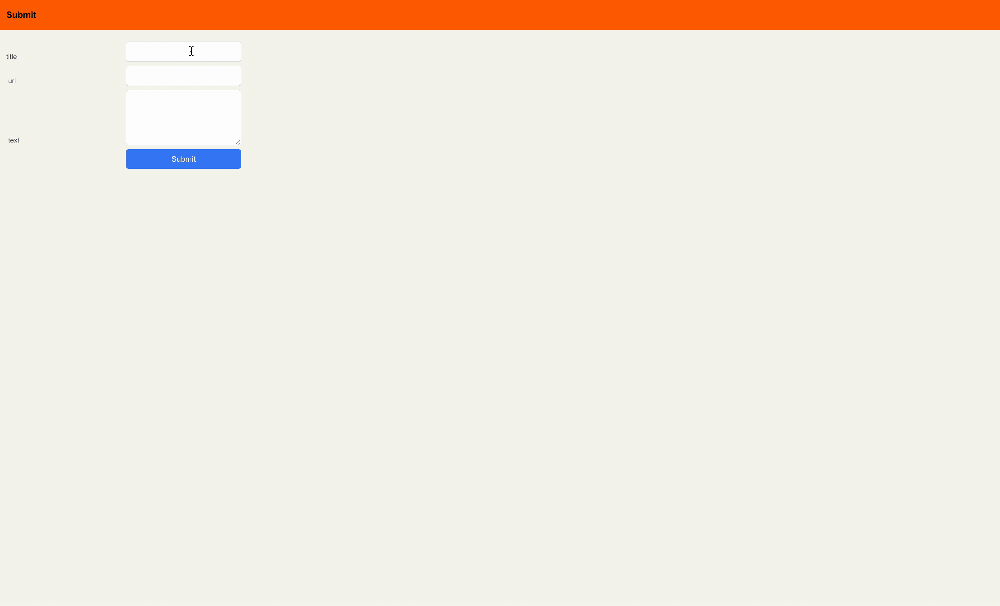

# Prisma Accelerate Hacker News Clone

This project showcases how to use Prisma ORM with Prisma Accelerate, leveraging caching and on-demand cache invalidation, in a Next.js application to build a minimal Hacker News clone.

This app retrieves and caches the [top 20 latest posts](/app/page.tsx#L8) with a long Time-to-Live ([TTL](https://www.prisma.io/docs/accelerate/caching#time-to-live-ttl)). The cache is invalidated on-demand whenever a post is [upvoted](/app/actions/addVotes.ts) or a [new post is added](/app/submit/actions/addPost.ts).



## Prerequisites

To successfully run the project, you will need the following:

- The **connection string** of a PostgreSQL database
- Your **Accelerate connection string** (containing your **Accelerate API key**) which you can get by enabling Accelerate in a project in your [Prisma Data Platform](https://pris.ly/pdp) account (learn more in the [docs](https://www.prisma.io/docs/platform/concepts/environments#api-keys))

## Getting started

### 1. Clone the repository

Clone the repository, navigate into it and install dependencies:

```
git clone git@github.com:prisma/prisma-examples.git --depth=1
cd prisma-examples/accelerate/accelerate-hacker-news
npm install
```

### 2. Configure environment variables

Create a `.env` in the root of the project directory:

```bash
cp .env.example .env
```

Now, open the `.env` file and set the `DATABASE_URL` and `DIRECT_URL` environment variables with the values of your connection string and your Accelerate connection string:

```bash
# .env

# Accelerate connection string (used for queries by Prisma Client)
DATABASE_URL="__YOUR_ACCELERATE_CONNECTION_STRING__"

# Database connection string (used for migrations by Prisma Migrate)
DIRECT_URL="__YOUR_DATABASE_CONNECTION_STRING__"
```

Note that `__YOUR_DATABASE_CONNECTION_STRING__` and `__YOUR_ACCELERATE_CONNECTION_STRING__` are placeholder values that you need to replace with the values of your database and Accelerate connection strings. Notice that the Accelerate connection string has the following structure: `prisma://accelerate.prisma-data.net/?api_key=__YOUR_ACCELERATE_API_KEY__`.

### 3. Run a migration to create the `Post` table

The Prisma schema file contains a single `Post` model. You can map this model to the database and create the corresponding `Post` table using the following command:

```
npx prisma migrate dev --name init
```

### 4. Generate Prisma Client for Accelerate

When using Accelerate, Prisma Client doesn't need a query engine. That's why you should generate it as follows:

```
npx prisma generate --no-engine
```

### 5. Start the app

You can run the app with the following command:

```
npm run dev
```

You should now be able to:

- See the most recent post at http://localhost:3000 and upvote it by clicking the ▲ button.
- Submit a new post by navigating to http://localhost:3000/submit.

When you make changes, it might take a few seconds to invalidate the cache and display the latest changes.

## Resources

- [Accelerate Speed Test](https://accelerate-speed-test.vercel.app/)
- [Accelerate documentation](https://www.prisma.io/docs/accelerate)
- [Prisma Discord](https://pris.ly/discord)
