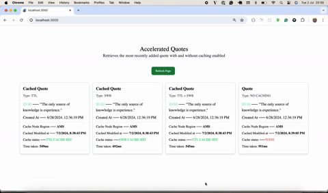

# Prisma Accelerate Example: SolidStart Starter

## Introduction
The quote generator retrieves the most recently added quote with and without caching enabled from a predefined set of quotes. In the context of your Solidstart application, the quote generator is a service that provides quotes, with some caching strategies applied to optimize performance and reduce the load on the database.

## General Steps of the Quote Generator:
- Fetch a quote: Retrieves the most recently added quote with and without caching enabled.
- Apply caching strategy: Depending on the request, it may apply different caching strategies (e.g., TTL, SWR, TTL+SWR or no caching).
- Return the quote: The selected quote is returned, along with metadata about the caching status and other relevant information.

This project showcases how to use Prisma ORM with Prisma Accelerate in a SolidStart application. It [demonstrates](./src/routes/api/quotes.ts#L18-32) every available [caching strategy in Accelerate](https://www.prisma.io/docs/accelerate/caching#cache-strategies).

## Prerequisites

To successfully run the project, you will need the following:

- The **connection string** of a publicly accessible database
- Your **Accelerate connection string** (containing your **Accelerate API key**) which you can get by enabling Accelerate in a project in your [Prisma Data Platform](https://pris.ly/pdp) account (learn more in the [docs](https://www.prisma.io/docs/platform/about#api-keys))


## Getting started

### 1. Clone the repository

Clone the repository, navigate into it and install dependencies:

```
git clone git@github.com:prisma/prisma-examples.git --depth=1
cd prisma-examples/accelerate/solidstart-starter
npm install
```

### 2. Configure environment variables

Create a `.env` in the root of the project directory:

```bash
touch .env
```

Now, open the `.env` file and set the `DATABASE_URL` and `DIRECT_URL` environment variables with the values of your connection string and your Accelerate connection string:

```bash
# .env

# Accelerate connection string (used for queries by Prisma Client)
DATABASE_URL="__YOUR_ACCELERATE_CONNECTION_STRING__"

# Database connection string (used for migrations by Prisma Migrate)
DIRECT_URL="__YOUR_DATABASE_CONNECTION_STRING__"

SOLID_START_PUBLIC_URL="http://localhost:3000"
```

Note that `__YOUR_DATABASE_CONNECTION_STRING__` and `__YOUR_ACCELERATE_CONNECTION_STRING__` are placeholder values that you need to replace with the values of your database and Accelerate connection strings. Notice that the Accelerate connection string has the following structure: `prisma://accelerate.prisma-data.net/?api_key=__YOUR_ACCELERATE_API_KEY__`.

### 3. Run a migration to create the `Quotes` table and seed the database

The Prisma schema file contains a single `Quotes` model. You can map this model to the database and create the corresponding `Quotes` table using the following command:

```
npx prisma migrate dev --name init
```

You now have an empty `Quotes` table in your database. Next, run the [seed script](./prisma/seed.ts) to create some sample records in the table:

```
 npx prisma db seed
```

### 4. Generate Prisma Client for Accelerate

When using Accelerate, Prisma Client doesn't need a query engine. That's why you should generate it as follows:

```
npx prisma generate --no-engine
```

### 5. Start the app

You can run the app with the following command:

```
npm run dev
```

You will now be able to retrieve the most recently added quote with and without caching enabled along with some stats.



You can see the performance and other stats (e.g. cache/hit) for the different Accelerate cache strategies at the bottom of the UI:


## Resources

- [Accelerate Speed Test](https://accelerate-speed-test.vercel.app/)
- [Accelerate documentation](https://www.prisma.io/docs/accelerate)
- [Prisma Discord](https://pris.ly/discord)