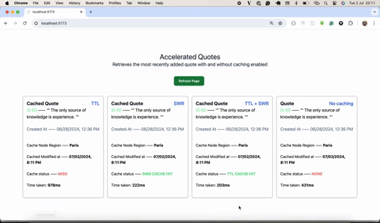

# Prisma Accelerate Example: Sveltekit Starter

## Introduction
The quote generator retrieves the most recently added quote with and without caching enabled from a predefined set of quotes. In the context of your Sveltekit application, the quote generator is a service that provides quotes, with some caching strategies applied to optimize performance and reduce the load on the database.

## General Steps of the Quote Generator:
- Fetch a quote: Retrieves the most recently added quote with and without caching enabled.
- Apply caching strategy: Depending on the request, it may apply different caching strategies (e.g., TTL, SWR, TTL+SWR or no caching).
- Return the quote: The selected quote is returned, along with metadata about the caching status and other relevant information.

This project showcases how to use Prisma ORM with Prisma Accelerate in a Sveltekit application. It [demonstrates](./src/routes/api/quotes/+server.ts#L18-33) every available [caching strategy in Accelerate](https://www.prisma.io/docs/data-platform/accelerate/concepts#cache-strategies).

## Prerequisites

To successfully run the project, you will need the following:

- The **connection string** of a publicly accessible database
- Your **Accelerate connection string** (containing your **Accelerate API key**) which you can get by enabling Accelerate in a project in your [Prisma Data Platform](https://pris.ly/pdp) account (learn more in the [docs](https://www.prisma.io/docs/platform/concepts/environments#api-keys))

## Getting started

### 1. Clone the repository

Clone the repository, navigate into it and install dependencies:

```
git clone git@github.com:prisma/prisma-examples.git --depth=1
cd prisma-examples/accelerate/svelte-starter
npm install
```

### 2. Configure environment variables

Create a `.env` in the root of the project directory:

```bash
touch .env
```

Now, open the `.env` file and set the `DATABASE_URL` and `DIRECT_URL` environment variables with the values of your connection string and your Accelerate connection string:

```bash
# .env

# Accelerate connection string (used for queries by Prisma Client)
DATABASE_URL="__YOUR_ACCELERATE_CONNECTION_STRING__"

# Database connection string (used for migrations by Prisma Migrate)
DIRECT_URL="__YOUR_DATABASE_CONNECTION_STRING__"

VITE_PUBLIC_URL="http://localhost:5173"
```

Note that `__YOUR_DATABASE_CONNECTION_STRING__` and `__YOUR_ACCELERATE_CONNECTION_STRING__` are placeholder values that you need to replace with the values of your database and Accelerate connection strings. Notice that the Accelerate connection string has the following structure: `prisma://accelerate.prisma-data.net/?api_key=__YOUR_ACCELERATE_API_KEY__`.

### 3. Run a migration to create the `Quotes` table and seed the database

The Prisma schema file contains a single `Quotes` model. You can map this model to the database and create the corresponding `Quotes` table using the following command:

```
npx prisma migrate dev --name init
```

You now have an empty `Quotes` table in your database. Next, run the [seed script](./prisma/seed.ts) to create some sample records in the table:

```
 npx prisma db seed
```

### 4. Generate Prisma Client for Accelerate

When using Accelerate, Prisma Client doesn't need a query engine. That's why you should generate it as follows:

```
npx prisma generate --no-engine
```

### 5. Start the app

You can run the app with the following command:

```
npm run dev
```

You will now be able to retrieve the most recently added quote with and without caching enabled along with some stats.



## Resources

- [Accelerate Speed Test](https://accelerate-speed-test.vercel.app/)
- [Accelerate documentation](https://www.prisma.io/docs/accelerate)
- [Prisma Discord](https://pris.ly/discord)