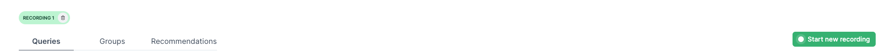

# Prisma Optimize Example: Applying the "Repeated query" Recommendation

This repository demonstrates how to use [Prisma Optimize](https://pris.ly/optimize) to improve query performance using the "Repeated query" recommendation.

## Prerequisites

To successfully run the project, you will need the following:

1. A **database connection string** supported by Prisma Optimize and Prisma Accelerate.
2. An Optimize API key, which you can obtain from your [Prisma Data Platform](https://pris.ly/pdp) account.
3. An Accelerate API key, which you can obtain from your [Prisma Data Platform](https://pris.ly/pdp) account.

## Getting started

### 1. Clone the repository

Clone the repository, navigate into it, and install the dependencies:

```bash
git clone git@github.com:prisma/prisma-examples.git --depth=1
cd prisma-examples/optimize/optimize-repeated-query
npm install
```

### 2. Configure environment variables

Create a `.env` file in the root of the project directory:

```bash
cp .env.example .env
```

Next, open the `.env` file and update the `DATABASE_URL` with your database connection string and the `OPTIMIZE_API_KEY` with your Optimize API key:

```env
# .env
DATABASE_URL="__YOUR_DATABASE_CONNECTION_STRING__"
# Replace __YOUR_DATABASE_CONNECTION_STRING__ with your actual connection string.
OPTIMIZE_API_KEY="your_secure_optimize_api_key"
```

- `DATABASE_URL`: The connection string to your database.
- `OPTIMIZE_API_KEY`: Reference the [Environment API Keys](https://www.prisma.io/docs/platform/about#environment) section in our documentation to learn how to obtain an API key for your project using Optimize.

### 3. Set up the project

Perform a database migration to prepare the project:

```bash
npx prisma migrate dev --name init
```

If the database isn't seeded, run the following command to seed it:

```bash
npx prisma db seed
```

### 4. Open the Optimize dashboard

You can create [recordings](https://pris.ly/optimize-recordings) and view detailed insights into your queries, along with optimization [recommendations](https://pris.ly/optimize-recommendations), in the Optimize dashboard. To access the dashboard:

1. Log in to your [Prisma Data Platform](https://console.prisma.io/optimize) account. If you haven't already, complete the onboarding process for Optimize by clicking the **Get Started** button.
2. If Optimize hasn't been launched yet, click the **Launch Optimize** button.
3. If you want to use a different workspace, navigate to your desired [Workspace](https://www.prisma.io/docs/platform/about#workspace), click the **Optimize** tab on the left sidebar to open the Optimize dashboard. Then, if Optimize is not yet launched, click the **Launch Optimize** button.

### 5. Run the script

Let's run the [script with unoptimized Prisma queries](./script.ts):

1. In the Optimize dashboard, click the **Start new recording** button.
2. In the project terminal, run the project with:

   ```bash
   npm run dev
   ```

3. After the script completes, you'll see a log saying "Done." Then, in the Optimize dashboard, click the **Stop recording** button.
4. Observe the queries with high latencies highlighted in red, and review the recommendations in the **Recommendations** tab. You should see the recommendation **Repeated query** and click on it.
     > For more insights on this recommendation, click the **Ask AI** button and interact with the [AI Explainer](https://pris.ly/optimize-ai-chatbot) chatbot.
5. To create a reference for comparison with other recordings, rename the recording labelled "Recording 1" to _Unoptimized queries_ by clicking the green recording label chip in the top left corner and typing "Unoptimized queries".

   

### Add Prisma Accelerate to the project

To apply the recommendation, you need to add Prisma Accelerate to the project. To do that:

1. Use your database connection string and enable Prisma Accelerate in your [Prisma Data Platform account](https://pris.ly/pdp).
2. Install the required dependencies:
    ```bash
    npm install @prisma/client@latest @prisma/extension-accelerate
    ```
3. Update [the database connection string to use the Accelerate connection string](https://www.prisma.io/docs/accelerate/getting-started#21-update-your-database-connection-string).
4. Regenerate `PrismaClient`:
    ```bash
    npx prisma generate --no-engine
    ```
5. Extend `PrismaClient` by using the Accelerate client extension in [utils/db.ts](./utils/db.ts) folder:
    ```diff
    import { PrismaClient } from '@prisma/client'
    + import { withAccelerate } from '@prisma/extension-accelerate'
    import { withOptimize } from '@prisma/extension-optimize'

    export const prisma = new PrismaClient().$extends(
      withOptimize({
        apiKey: process.env.OPTIMIZE_API_KEY!,
      }),
    )
    + .$extends(withAccelerate());
    ```

Afterward, continue with the next steps to complete the recommendation.

### Optimize example: Applying the "Repeated query" recommendation

Next, let’s follow the recommendation provided by Optimize to improve the performance of the queries:

1. To enhance the performance of [**Query 1**](./script.ts) through [**Query 5**](./script.ts) by addressing the "Repeated query" recommendation, add a [cache strategy](https://prisma.io/docs/accelerate/caching) to the queries:

    ```diff
      // Query 1
    await prisma.user.findFirst({
      select: {
        name: true,
      },
    +  cacheStrategy: {
    +    ttl: 120
    +  }
    })

    // Query 2
    await prisma.user.findFirst({
      select: {
        name: true,
      },
    +  cacheStrategy: {
    +    ttl: 120
    +  }
    })

    // Query 3
    await prisma.user.findFirst({
      select: {
        name: true,
      },
    +  cacheStrategy: {
    +    ttl: 120
    +  }
    })

    // Query 4
    await prisma.user.findFirst({
      select: {
        name: true,
      },
    +  cacheStrategy: {
    +    ttl: 120
    +  }
    })

    // Query 5
    await prisma.user.findFirst({
      select: {
        name: true,
      },
    +  cacheStrategy: {
    +    ttl: 120
    +  }
    })
    ```
2. Click the **Start new recording** button to begin a new recording and check for any performance improvements.
3. In the project terminal, run the project with:
   ```bash
   npm run dev
   ```
4. After the script completes, click the **Stop recording** button.
5. Rename the recording labelled "Recording 1" to _Optimized queries_ by clicking the recording chip in the top left corner and typing "Optimized queries."

You can now compare performance improvements by navigating to the "Optimized queries" and "Unoptimized queries" recording tabs and observing the query latency differences.

---

## Next steps

- Check out the [Optimize docs](https://pris.ly/d/optimize).
- Share your feedback on the [Prisma Discord](https://pris.ly/discord/).
- Create issues and ask questions on [GitHub](https://github.com/prisma/prisma/).
