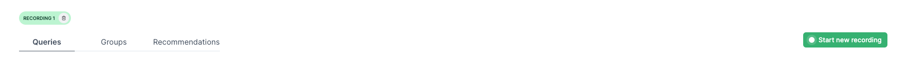

# Prisma Optimize Example: Applying the "Query filtering on an unindexed column" Recommendation

This repository demonstrates how to use [Prisma Optimize](https://pris.ly/optimize) to improve query performance using the "Query filtering on an unindexed column" recommendation.

## Prerequisites

To successfully run the project, you will need the following:

1. A **database connection string** supported by Prisma Optimize.
2. An Optimize API key, which you can obtain from your [Prisma Data Platform](https://pris.ly/pdp) account.

## Getting started

### 1. Clone the repository

Clone the repository, navigate into it, and install the dependencies:

```bash
git clone git@github.com:prisma/prisma-examples.git --depth=1
cd prisma-examples/optimize/optimize-unindexed-column
npm install
```

### 2. Configure environment variables

Create a `.env` file in the root of the project directory:

```bash
cp .env.example .env
```

Next, open the `.env` file and update the `DATABASE_URL` with your database connection string and the `OPTIMIZE_API_KEY` with your Optimize API key:

```env
# .env
DATABASE_URL="__YOUR_DATABASE_CONNECTION_STRING__"
# Replace __YOUR_DATABASE_CONNECTION_STRING__ with your actual connection string.
OPTIMIZE_API_KEY="your_secure_optimize_api_key"
```

- `DATABASE_URL`: The connection string to your database.
- `OPTIMIZE_API_KEY`: Reference the [Environment API Keys](https://www.prisma.io/docs/platform/about#environment) section in our documentation to learn how to obtain an API key for your project using Optimize.

### 3. Set up the project

Perform a database migration to prepare the project:

```bash
npx prisma migrate dev --name init
```

If the database isn't seeded, run the following command to seed it:

```bash
npx prisma db seed
```

### 4. Open the Optimize dashboard

You can create [recordings](https://pris.ly/optimize-recordings) and view detailed insights into your queries, along with optimization [recommendations](https://pris.ly/optimize-recommendations), in the Optimize dashboard. To access the dashboard:

1. Log in to your [Prisma Data Platform](https://console.prisma.io/optimize) account. If you haven't already, complete the onboarding process for Optimize by clicking the **Get Started** button.
2. If Optimize hasn't been launched yet, click the **Launch Optimize** button.
3. If you want to use a different workspace, navigate to your desired [Workspace](https://www.prisma.io/docs/platform/about#workspace), click the **Optimize** tab on the left sidebar to open the Optimize dashboard. Then, if Optimize is not yet launched, click the **Launch Optimize** button.

### 5. Run the script

Let's run the [script with unoptimized Prisma queries](./script.ts):

1. In the Optimize dashboard, click the **Start new recording** button.
2. In the project terminal, run the project with:

   ```bash
   npm run dev
   ```

3. After the script completes, you'll see a log saying "Done." Then, in the Optimize dashboard, click the **Stop recording** button.
4. Observe the queries with high latencies highlighted in red, and review the recommendations in the **Recommendations** tab. You should see the recommendation:
   - **Query filtering on an unindexed column**
     > For more insights on this recommendation, click the **Ask AI** button and interact with the [AI Explainer](https://pris.ly/optimize-ai-chatbot) chatbot.
5. To create a reference for comparison with other recordings, rename the recording to _Unoptimized queries_ by clicking the green recording label chip in the top left corner and typing "Unoptimized queries".

   

### Optimize example: Applying the "Query filtering on an unindexed column" recommendation

Next, let’s follow the recommendation provided by Optimize to improve the performance of the queries:

1. To enhance the performance of [**Query 1**](./script.ts) through [**Query 3**](./script.ts) by addressing the [**Query filtering on an unindexed column**](https://pris.ly/optimize/r/unindexed-column) recommendation, add an `index` to the `name` column (commonly used in the queries) in the `User` model within the [`schema.prisma`](./prisma/schema.prisma) file:

   ```diff
   model User {
      id    Int     @id @default(autoincrement())
      email String  @unique
      name  String?
      posts Post[]
   +  @@index(name)
    }
   ```

2. After making these changes, migrate them to your database using:

   ```bash
   npx prisma migrate dev --name create-name-index-on-user-model
   ```

3. Click the **Start new recording** button to begin a new recording and check for any performance improvements.
4. In the project terminal, run the project with:
   ```bash
   npm run dev
   ```
5. After the script completes, click the **Stop recording** button.
6. Rename the recording to _Optimized queries_ by clicking the recording chip in the top left corner and typing "Optimized queries."

You can now compare performance improvements by navigating to the "Optimized queries" and "Unoptimized queries" recording tabs and observing the query latency differences.

---

## Next steps

- Check out the [Optimize docs](https://pris.ly/d/optimize).
- Share your feedback on the [Prisma Discord](https://pris.ly/discord/).
- Create issues and ask questions on [GitHub](https://github.com/prisma/prisma/).
