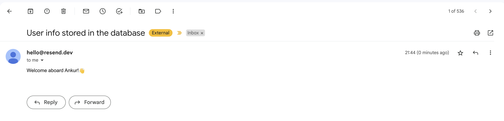

# Prisma Pulse and Resend Integration Example

This repository contains an example app that uses Prisma Pulse to detect when new users are added to the database and sends them an onboarding email using [Resend](https://resend.com/).


## Prerequisites

1. A Prisma Pulse-compatible PostgreSQL database. If you don't have one yet, you can learn how to set it up in our [docs](https://www.prisma.io/docs/pulse/database-setup).
2. Visit [Prisma Data Platform](https://pris.ly/pdp) and enable Pulse in your project environment to get a Pulse API key.
3. Create a [Resend account](https://resend.com/) and get the Resend API Key.

## Getting Started

To get started, follow these steps:

1. Clone the repository, navigate into it and install dependencies:

    ```bash
    git clone git@github.com:prisma/prisma-examples.git --depth=1
    cd prisma-examples/prisma-data-platform/pulse/email-with-resend
    npm install
    ```

2. Create a `.env` file in the root directory and provide your Database URL, Prisma Pulse and Resend API key:

   ```bash
   DATABASE_URL=""
   PULSE_API_KEY=""
   RESEND_API_KEY=""
   ```

## Run the app

1. Start the script using:

   ```bash
   npm run dev
   ```

2. Add a new user record with a valid email to the `User` table in the database using Prisma Studio or any other database tool:

   ```bash
   npm prisma studio
   ```

3. Add a new user with a `name` and a *valid* `email`.
4. You will receive a new email in the insterted email inbox. For example: When a new user with an email of `datta@prisma.io` and a name of `Ankur` is created, the email inbox for `datta@prisma.io` should have a new email:
   

## Next steps

- Checkout the Prisma Pulse [docs](https://www.prisma.io/docs/pulse).
- Reach out to us in [Discord](https://pris.ly/discord) if you need help.
