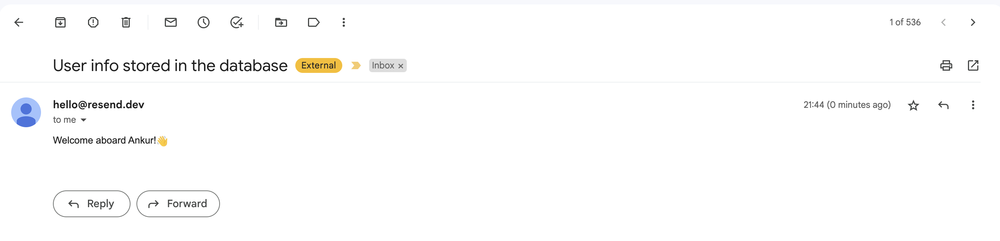

# Prisma Pulse Example: Send Onboarding Email with Resend

This repository contains an example app that uses Prisma Pulse to detect when new users are added to the database and sends them an onboarding email using [Resend](https://resend.com/).


## Prerequisites

To successfully run the project, you will need the following:

- The **connection string** of a Pulse-ready database (if you don't have one yet, you can configure your database following the instructions in our [docs](https://www.prisma.io/docs/pulse/database-setup) or [use a Railway template](https://railway.app/template/pulse-pg?referralCode=VQ09uv))
- A **Pulse API key** which you can get by enabling Pulse in a project in your [Prisma Data Platform](https://pris.ly/pdp) account (learn more in the [docs](https://www.prisma.io/docs/platform/concepts/environments#api-keys))
- A **Resend API Key** which you can get from your [Resend account](https://resend.com/api-keys)

## Getting started

### 1. Clone the respository

Clone the repository, navigate into it and install dependencies:

```
git clone git@github.com:prisma/prisma-examples.git --depth=1
cd prisma-examples/pulse/email-with-resend
npm install
```

### 2. Configure environment variables

Create a `.env` in the root of the project directory:

```bash
touch .env
```

Now, open the `.env` file and update the `DATABASE_URL` and `PULSE_API_KEY` environment variables with the values of your connection string, your Pulse and Resend API keys:

```bash
# .env
DATABASE_URL="__YOUR_DATABASE_CONNECTION_STRING__"
PULSE_API_KEY="__YOUR_PULSE_API_KEY__"
RESEND_API_KEY="__YOUR_RESEND_API_KEY__"
```

Note that `__YOUR_DATABASE_CONNECTION_STRING__`, `__YOUR_PULSE_API_KEY__` and `__YOUR_RESEND_API_KEY__` are placeholder values that you need to replace with the values of your own connection string, your Pulse and Resend API keys.

### 3. Run a database migration to create the `User` table

The [Prisma schema file](./prisma/schema.prisma) in this project contains a single `User` model. You can map this model to the database and create the corresponding `User` table using the following command:

```
npx prisma migrate dev --name init
```

You now have an empty `User` table in your database.

### 4. Start the Pulse subscription

Run the [script](./index.ts) that contains the code to subscribe to database events:

```
npm run dev
```

This will run a subscription on the `User` table that fires an event whenever a new record is _created_ in that table. When the script receives the event, it'll use the `Resend` client to send an email to the `email` that was specified on the new `User` record.

### 5. Test the subscription

The following instructions use [Prisma Studio](https://www.prisma.io/studio) to create a new record in the `User` table. However, you can use any other method to write to the `User` table (e.g. a SQL client like `psql` or [TablePlus](https://tableplus.com/)) in order to trigger a database change event in Pulse.

1. Start Prisma Studio in a new terminal: `npx prisma studio`
2. Add a new record to the `User` table via Prisma Studio UI. **This new record needs to have a _valid_ value for the `email` field.**
3. You will receive a new email in the inbox of the specified `email`. For example: When a new user with an email of `datta@prisma.io` and a name of `Ankur` is created, the email inbox for `datta@prisma.io` should have received the following email (the copy for this email is hardcoded in [`./script.ts`](./script.ts#L33)):
   

## Resources

- [Pulse examples](https://pris.ly/pulse-examples)
- [Pulse documentation](https://pris.ly/pulse-docs)
- [Pulse announcement blog post](https://pris.ly/gh/pulse-ga)
- [Prisma Discord](https://pris.ly/discord)
