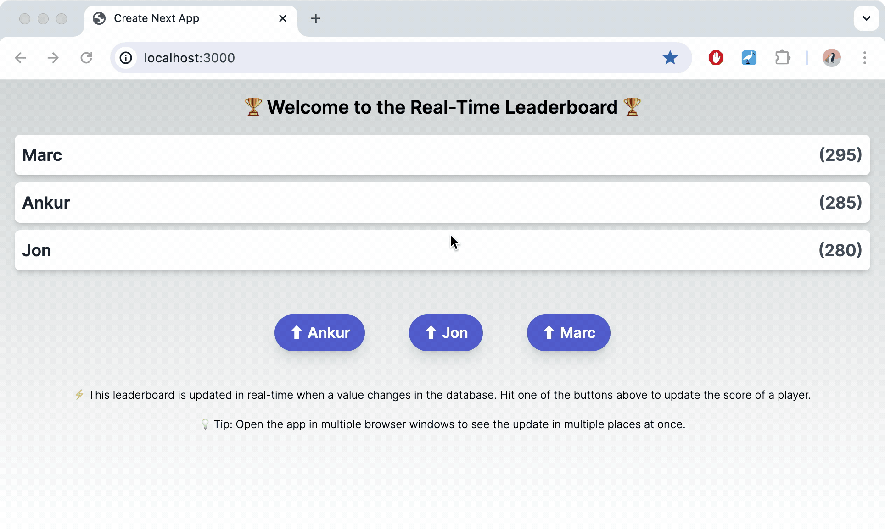

# Prisma Pulse Example: Fullstack Leaderboard (Next.js)



This repository contains an example app that uses Prisma Pulse in a fullstack application to display and update a real-time leaderboard:

- [Next.js](https://nextjs.org/) (_frontend_) with a [custom server](https://nextjs.org/docs/pages/building-your-application/configuring/custom-server) (_backend_)
- [React Flip Move](https://github.com/joshwcomeau/react-flip-move) for animating React components
- [socket.io](https://socket.io/) for the websocket connection between client and server
- [Prisma Pulse](https://www.prisma.io/data-platform/pulse) to get real-time updates from the database
- [PostgreSQL](https://www.postgresql.org/) as the database

> **Note**: The custom server is required because Pulse requires a long-running connection to the database. As an alternative to the custom server included in this app, you can also build your own server using a library/framework like Express, Fastify or NestJS.


## Prerequisites

To successfully run the project, you will need the following:

- The **connection string** of a Pulse-ready database (if you don't have one yet, you can configure your database following the instructions in our [docs](https://www.prisma.io/docs/pulse/database-setup) or [use a Railway template](https://railway.app/template/pulse-pg?referralCode=VQ09uv))
- A **Pulse API key** which you can get by enabling Pulse in a project in your [Prisma Data Platform](https://pris.ly/pdp) account (learn more in the [docs](https://www.prisma.io/docs/platform/concepts/environments#api-keys))

## Getting started

### 1. Clone the respository

Clone the repository, navigate into it and install dependencies:

```
git clone git@github.com:prisma/prisma-examples.git --depth=1
cd prisma-examples/pulse/fullstack-leaderboard
npm install
```

### 2. Configure environment variables

Create a `.env` in the root of the project directory:

```bash
touch .env
```

Now, open the `.env` file and update the `DATABASE_URL` and `PULSE_API_KEY` environment variables with the values of your connection string and your Pulse API keys:

```bash
# .env
DATABASE_URL="__YOUR_DATABASE_CONNECTION_STRING__"
PULSE_API_KEY="__YOUR_PULSE_API_KEY__"
```

Note that `__YOUR_DATABASE_CONNECTION_STRING__` and `__YOUR_PULSE_API_KEY__` are **placeholder values that you must replace** with the values of your own connection string and Pulse API key.

### 3. Run a database migration to create the `Player` table

The [Prisma schema file](./prisma/schema.prisma) in this project contains a single `Player` model. You can map this model to the database and create the corresponding `Player` table using the following command:

```
npx prisma migrate dev --name init
```

You now have a table called `Player` in your database.

Next, run the following command to [seed](./prisma/seed.ts) the database with some dummy data:

```
npx prisma db seed
```

The is invoked the [seed script](./prisma/seed.ts) and created three `Player` records in the database.


### 4. Start the server

Make sure you're inside the [`server`](./server) directory and start the long-running server that streams changes from the database:

```
npm run server
```

The server will accept WebSocket connections at `http://localhost:3001`.

Next, run the Next.js app:

```
npm run dev
```

You can open the app at [`http://localhost:3000`](http://localhost:3000).

Every new tab/window you open in your browser and point to that URL will instantiate its own WebSocket connection to the long-running server.

### 5. Use the app

Click on the buttons at the bottom to increase the score of a player and see how the leaderboard updates in real-time.

## Deployment

Because the app requires a [custom server](https://nextjs.org/docs/pages/building-your-application/configuring/custom-server) to enable the WebSocket connections, you need to deploy the frontend and the [backend](./src/server.ts) separately.

### Deploying on Railway

In the following, you find instructions to deploy the app via [Railway](https://railway.app). In order to deploy successfully, you need:
- a Railway account
- the Railway CLI installed on your machine


#### Deploying the frontend

Create a new

#### Deploying the backend

## Resources

- [Pulse examples](https://pris.ly/pulse-examples)
- [Pulse documentation](https://pris.ly/pulse-docs)
- [Pulse announcement blog post](https://pris.ly/gh/pulse-ga)
- [Prisma Discord](https://pris.ly/discord)
