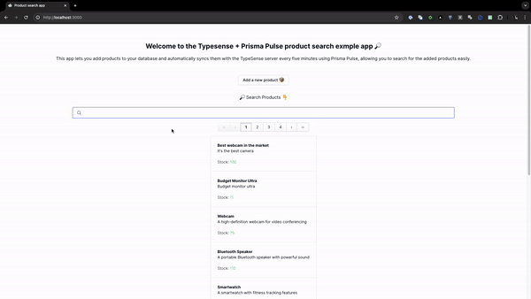

# Prisma Pulse Example: Product Search with Typesense, Cloudflare Workers, and Next.js



This repository showcases an example application using Prisma Pulse to synchronize products with Typesense, a search server.
The backend uses a [CRON task](https://hono.dev/getting-started/cloudflare-workers#using-hono-with-other-event-handlers) that runs every 15 minutes, capturing all events (Create, Update, Delete) related to the `Product` model in the database and updating the Typesense search server accordingly. As Prisma Pulse has **delivery gurantees**, all events are delivered *at-least once*. The frontend allows you to search the products using Typesense.

- [Next.js](https://nextjs.org/) (_frontend_) enables you to add new products to the PostgreSQL database and search them using [Typesense](https://typesense.org/).
- [Hono.js](https://hono.dev/) (_backend_) allows you to create new products and runs a CRON task every **15 minutes** that utilizes Prisma Pulse to sync events with Typesense.
- [Typesense](https://typesense.org/) is an open-source search server.
- [Prisma Pulse](https://www.prisma.io/data-platform/pulse) provides real-time updates from the database.
- [PostgreSQL](https://www.postgresql.org/) serves as the database.

> **Note**: You can use either [Typesense Open Source](https://typesense.org/docs/guide/) or [Typesense Cloud](https://cloud.typesense.org/) for this example.

## Prerequisites

To successfully run the project, you will need the following:

- The **connection string** of a Pulse-ready database (if you don't have one yet, you can configure your database following the instructions in our [docs](https://www.prisma.io/docs/pulse/database-setup) or [use a Railway template](https://railway.app/template/pulse-pg?referralCode=VQ09uv))
- A **Pulse API key** which you can get by enabling Pulse in a project in your [Prisma Data Platform](https://pris.ly/pdp) account (learn more in the [docs](https://www.prisma.io/docs/platform/concepts/environments#api-keys))
- A [**Typesense Admin API key**](https://typesense.org/docs/0.20.0/api/api-keys.html#create-an-api-key) that allows you to perform all operations and is used in the backend. Configuration to create the Admin API key:
    ```json
    {
      "description": "Admin key.",
      "actions": [
        "*"
      ],
      "collections": [
        "*"
      ]
    }
    ```
- A [**Typesense Search API Key**](https://typesense.org/docs/0.20.0/api/api-keys.html#create-an-api-key) that allows you to search products from the frontend. This API key is exposed on the frontend and allows you to perform a scoped search on the `products` collection. Configuration to create the Search API key:
    ```json
    {
      "description": "Search-only product key.",
      "actions": [
        "documents:search"
      ],
      "collections": [
        "products"
      ]
    }
    ```

## Getting started

### 1. Clone the respository

Clone the repository and navigate into the example:

```
git clone git@github.com:prisma/prisma-examples.git --depth=1
cd prisma-examples/pulse/typesense-product-search
```

### 2. Configure and start the backend

For the example to work, we have to setup and run the backend first. Navigate to the 	`backend` folder and install dependencies:

```bash
cd backend
npm install
```

#### 2.1. Configure environment variables for the backend

Create a `.dev.vars` in the root of the project directory:

```bash
touch .dev.vars
```

Now, open the `.dev.vars` file and update the `DATABASE_URL`, `TYPESENSE_ADMIN_API_KEY`, `TYPESENSE_URL`  and `PULSE_API_KEY` environment variables with the values of your connection string, your Pulse, your Typesense server URL and Typesense API key:

```bash
# .dev.vars
DATABASE_URL=""
PULSE_API_KEY=""
TYPESENSE_ADMIN_API_KEY=""
# Typesense URL should look like `https://xxx.typesense.net` (if you're using Typesense Cloud) or your self-hosted Typesense URL
TYPESENSE_URL=""
```

> Note that the API keys **must** be filled in for the app to work.

#### 2.2. Run a database migration to create the `Product` table

The [Prisma schema file](./backend/prisma/schema.prisma) in this project contains a single `Product` model. You can map this model to the database and create the corresponding `Product` table using the following command:
```bash
npm run migrate
```

You now have a table called `Product` in your database.

Next, run the following command to [seed](./backend/prisma/seed.js) the database with some dummy data:
```bash
npx prisma db seed
```

The is invoked the [seed script](./prisma/seed.js) and created ten `Product` records in the database.


#### 2.3. Start the backend server

Make sure you're inside the [`backend`](./backend/) directory and start the server that periodically syncs data to Typesense:

```bash
npm run dev
```

The server will start up at `http://localhost:8787`.

#### 2.4. Test the CRON task

Keep the server is running and open another terminal or CLI tab, then execute the command:

```bash
curl "http://localhost:8787/__scheduled?cron=*+*+*+*+*"
```

The output should read:

```
Ran scheduled event
```

Head over to the CLI tab/terminal of the running server and you should see Prisma Pulse syncing the database seed events to Typesense. Example:

```
  Pulse create event
  {
    action: 'create',
    created: {
      id: 298,
      title: 'Noise Cancelling Headphones',
      description: 'Headphones with active noise cancellation',
      stock: 120,
      createdAt: 2024-05-28T07:30:29.742Z,
      updatedAt: 2024-05-28T07:30:29.742Z
    },
    id: '01HYZ1Q79MN6YESP82R9ZXWQB5',
    modelName: 'Product'
  }
  Creating document in Typesense
  {
    createdAt: '2024-05-28T07:30:29.742Z',
    description: 'Headphones with active noise cancellation',
    id: '298',
    stock: 120,
    title: 'Noise Cancelling Headphones',
    updatedAt: '2024-05-28T07:30:29.742Z'
  }
```

If there are no events (Create, Update or Delete operations) to the `Product` model for 5 minutes, the CRON task will end with the message:

```
✘ [ERROR] Uncaught (async) Error: No events for 5 minutes.
```

### 3. Configure and start the frontend

Now we have to setup and run the frontend to perform the search. Navigate out of the [backend](./backend/) folder and into the [frontend](./frontend/) folder and install dependencies:

```bash
cd ..
cd ./frontend/
npm install
```

#### 3.1. Configure environment variables for the frontend

Create a `.env` in the root of the project directory:

```bash
touch .env
```

Now, open the `.env` file and update the `NEXT_PUBLIC_TYPESENSE_SEARCH_API_KEY`, `NEXT_PUBLIC_TYPESENSE_HOST`, and `NEXT_PUBLIC_BACKEND_URL` environment variables with the values of your typesense host, typesense search API key and the backend url:

```bash
# .env
NEXT_PUBLIC_TYPESENSE_SEARCH_API_KEY=
# example value: xxx.a1.typesense.net
NEXT_PUBLIC_TYPESENSE_HOST=
# example value: http://localhost:8787
NEXT_PUBLIC_BACKEND_URL=
```

> Note that the API keys **must** be filled in for the app to work.

#### 3.2. Start the frontend server

Make sure you're inside the [`frontend`](./frontend/) directory and the backend server is running to make sure the frontend server works as expected. To start the frontend server execute:

```bash
npm run dev
```

The server will start up at `http://localhost:3000`.

If you followed the instructions and made sure the [cron task](#24-test-the-cron-task) works successfully, you should be able to search for the seeded `Product` data.

You can add new products through the frontend and [execute the CRON task](#24-test-the-cron-task) again to search the new products.

## Deployment

As the app as two components a frontend and backend, you have to deploy them separately.

### Deploying the backend on Cloudflare

To deploy the backend in [Cloudflare](https://www.cloudflare.com/). Follow the instuctions [here](https://developers.cloudflare.com/workers/configuration/secrets/#secrets-in-development) to upload the environment variables. Then deploy the project to Cloudflare by running:

```bash
npm run deploy
```

### Deploying the frontend

You can deploy the Next.js frontend to [all platforms](https://nextjs.org/learn-pages-router/basics/deploying-nextjs-app) that support it.

## Resources

- [Pulse examples](https://pris.ly/pulse-examples)
- [Pulse documentation](https://pris.ly/pulse-docs)
- [Pulse announcement blog post](https://pris.ly/gh/pulse-ga)
- [Prisma Discord](https://pris.ly/discord)
